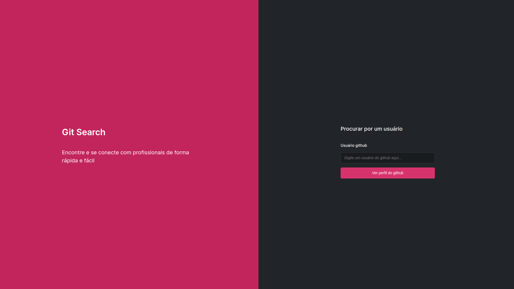

# GitHub User Search App

Bem-vindo ao README do projeto GitHub User Search App! Este projeto tem como objetivo desenvolver uma aplicação web que permite buscar por usuários do GitHub e exibir seus repositórios públicos. A aplicação inclui a capacidade de navegar entre páginas, lidar com casos de usuários não encontrados e fornecer informações detalhadas sobre os repositórios.

## 🚀 Tecnologias Utilizadas

- HTML5
- CSS3
- JavaScript
- Consumo da API do GitHub

## 💻 Como Usar

1. Acesse a [página inicial](https://capellinx.github.io/gitSearch/) da aplicação.
2. Utilize o campo de busca para procurar por um usuário do GitHub.
3. Se o usuário for encontrado, será exibida uma página com informações detalhadas:
   - 🖼️ Avatar do usuário
   - 👤 Nome de usuário
   - 📚 Lista de repositórios com nome, descrição e link.
4. Se o usuário não for encontrado, você será redirecionado automaticamente para a página de erro (404).

## 🌐 Navegação

- **Página Inicial:** [[URL_DO_SITE](https://capellinx.github.io/gitSearch/)]
- **Página de Usuário Encontrado:** [URL_DO_SITE/usuario](https://capellinx.github.io/gitSearch/src/pages/profile.html)
- **Página de Usuário Não Encontrado (404):** [[URL_DO_SITE/404](https://capellinx.github.io/gitSearch/src/pages/error.html)]

## 🎨 Design

O design da aplicação foi elaborado no Figma, proporcionando uma interface moderna e amigável. Confira o [protótipo no Figma](https://www.figma.com/file/bIs9q6AvhwT3IKNJknuOyx/Git-Search?type=design&node-id=0%3A1&mode=design&t=j74i1R3OtW3mg7BC-1) para ter uma visão mais detalhada.

## ⚙️ Funções Assíncronas

A aplicação utiliza funções assíncronas para otimizar o consumo da API do GitHub, garantindo uma resposta eficiente e evitando bloqueios no navegador durante as consultas.

## 📸 Imagens do Projeto

## 🤝 Contribuição

Fique à vontade para contribuir para este projeto! Se encontrar problemas, bugs ou tiver sugestões de melhorias, por favor, abra uma "issue" ou envie um "pull request". Estamos ansiosos para receber sua colaboração.

## 📝 Licença

Este projeto está licenciado sob a [Licença MIT](LICENSE.md).

---

**Desenvolvido por [Lucas Capella](https://www.linkedin.com/in/lucas-capella-608012202/) | capellaaa7@gmail.com**